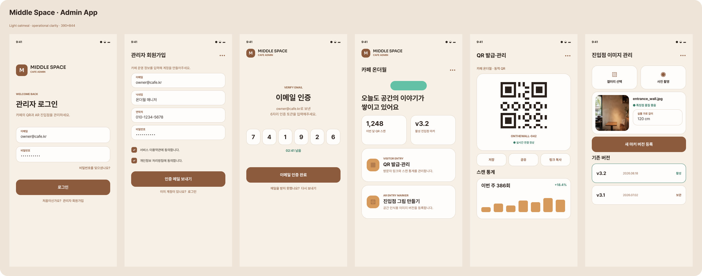

# Middle Space 관리자 앱

카페 운영자가 계정을 인증하고 매장, 방문 QR, 게시글, AR 진입점 이미지를 관리하는 Android 앱입니다. 사용자 앱과 같은 오트밀 계열을 사용하되, 정보 밀도와 상태 구분을 높인 운영 UI로 구성했습니다.



> 위 이미지는 현재 Jetpack Compose 구현의 기준이 되는 UI 디자인 시안입니다. 실제 실행 화면은 기기 비율과 서버 데이터에 따라 일부 달라질 수 있습니다.

## 현재 개발 상태

| 영역 | 상태 | 내용 |
| --- | --- | --- |
| 관리자 인증 | 구현 | 회원가입, 이메일 인증 토큰, 로그인, 토큰 갱신, 로그아웃 |
| 매장 운영 | 구현 | 매장 생성, 복수 매장 선택, 운영 상태와 요약 정보 표시 |
| QR 관리 | 구현 | 동적 QR 발급, 이미지 저장/공유, 방문자 링크 복사, 최근 7일 통계 |
| 게시글 관리 | 구현 | 승인 대기 조회, 승인·거절·숨김 처리 |
| 진입점 이미지 | 구현 | 갤러리/카메라 선택, 실물 너비 입력, 버전 등록과 활성화 |
| 운영 배포 | 준비 중 | 릴리스 서명, 운영 API/도메인, 스토어 배포 미완료 |

## 주요 화면

- 관리자 로그인과 회원가입
- 이메일 인증 토큰 입력
- 카페 운영 상태, QR 스캔 수, 활성 진입점 버전을 보여 주는 홈
- 동적 QR 저장·공유·링크 복사와 스캔 통계
- 게시글 승인·거절·숨김 관리
- 진입점 이미지 등록, 실물 가로 길이 입력, 버전 활성화

## Android 앱과 기존 웹 코드

현재 네이티브 관리자 앱은 `app/` 아래의 Kotlin/Jetpack Compose 프로젝트입니다. 저장소 루트의 `src/`와 `package.json`은 기존 React 관리자 웹 코드이며, 이번 네이티브 앱 작업 범위와 빌드에는 포함되지 않습니다.

## 기술 스택

- Kotlin, Jetpack Compose, Material 3
- Kotlin Coroutines
- Android Keystore 기반 토큰 암호화 저장
- Android 7.0(API 24) 이상

## 로컬 실행

1. 백엔드를 `http://localhost:8000`에서 실행합니다.
2. Android Studio에서 이 프로젝트를 열고 `app`을 실행합니다.

디버그 빌드의 기본 API 주소는 Android 에뮬레이터용 주소입니다.

```text
http://10.0.2.2:8000/api
```

필요하면 사용자 전용 `gradle.properties` 또는 명령행에서 변경합니다.

```properties
MIDDLESPACE_API_BASE_URL=http://192.168.0.10:8000/api
MIDDLESPACE_RELEASE_API_BASE_URL=https://api.example.com/api
```

실제 기기에서는 개발 PC의 LAN IP를 사용해야 하며, 릴리스 빌드는 HTTPS 주소만 사용하는 것을 전제로 합니다.

## 빌드와 검사

```powershell
.\gradlew.bat :app:assembleDebug
.\gradlew.bat :app:testDebugUnitTest
.\gradlew.bat :app:lintDebug
```

디버그 APK는 `app/build/outputs/apk/debug/app-debug.apk`에 생성됩니다.

## 보안 메모

- access/refresh token은 Android Keystore로 보호한 로컬 저장소에 보관합니다.
- 로그아웃 시 서버 refresh 쿠키와 기기 토큰을 함께 정리합니다.
- 인증 정보는 Android 클라우드 백업 및 기기 이전 대상에서 제외했습니다.
- 운영 빌드에서는 HTTPS API, 실제 SMTP, 안전한 서버 비밀값 구성이 필요합니다.

## 기존 React 웹 실행

웹 코드를 별도로 확인할 때만 사용합니다.

```bash
npm install
npm run dev
```

## 관련 저장소

- [사용자 앱](https://github.com/igwi292/MiddleSpaceKotlinUser)
- [백엔드](https://github.com/karl21-02/bokbukjeongundaesa-backend)
